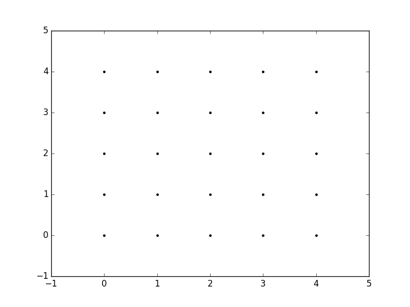
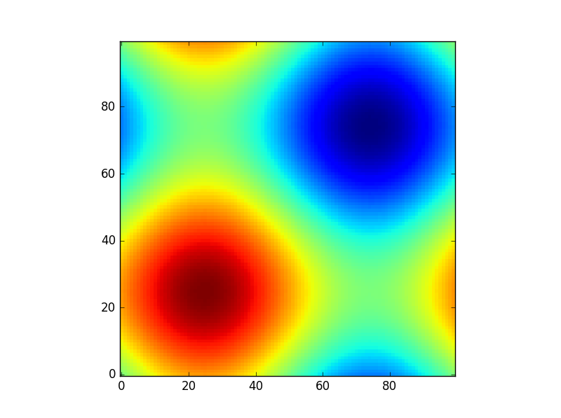
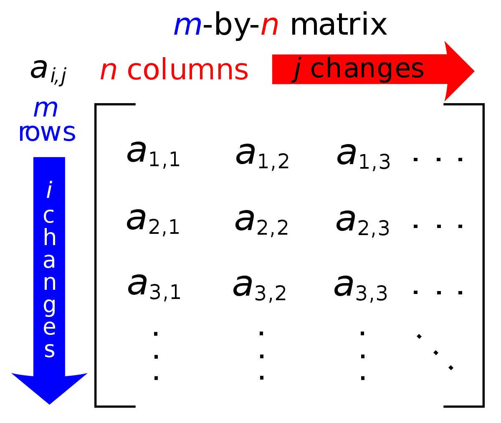

# Numpy Basics

Author: methylDragon  
Contains a syntax reference and code snippets for Numpy!  
It's a collection of code snippets and tutorials from everywhere all mashed together!       

------

## Pre-Requisites

### Required

- Python knowledge, this isn't a tutorial!
- Numpy installed
  - I'll assume you've already run this line as well `import numpy as np`


## Table Of Contents <a name="top"></a>

1. [Introduction](#1)    
2. [Array Basics](#2)    
   2.1 [Configuring Numpy](#2.1)    
   2.2 [Numpy Data Types](#2.2)    
   2.3 [Creating Arrays](#2.3)    
   2.4 [Array Basics and Attributes](#2.4)    
   2.5 [Casting](#2.5)    
   2.6 [Some Array Methods](#2.6)    
   2.7 [Array Indexing](#2.7)    
   2.8 [Array Slicing](#2.8)    
   2.9 [Reshaping Arrays](#2.9)    
   2.10 [Array Concatenation and Splitting](#2.10)    
   2.11 [Array Arithmetic](#2.11)    
   2.12 [More Array Math](#2.12)    
3. [Going Deeper With Arrays](#3)    
   3.1 [Broadcasting](#3.1)    
   3.2 [Vectorize](#3.2)    
   3.3 [Iterating Through Axes](#3.3)    
   3.4 [Modifying Output Directly](#3.4)    
   3.5 [Locating Elements](#3.5)    
   3.6 [Aggregations](#3.6)    
   3.7 [Comparisons](#3.7)    
   3.8 [Sorting Arrays](#3.8)    
   3.9 [Fancy Indexing](#3.9)    
   3.10 [Structured Arrays](#3.10)    
4. [Matrices](#4)    
   4.1 [Linear Algebra Functions](#4.1)    
5. [Numpy I/O](#5)    
   5.1 [Import from CSV](#5.1)    
   5.2 [Saving and Loading](#5.2)    


## 1. Introduction <a name="1"></a>

> NumPy is the fundamental package for scientific computing with Python. It contains among other things:
>
> - a powerful N-dimensional array object
> - sophisticated (broadcasting) functions
> - tools for integrating C/C++ and Fortran code
> - useful linear algebra, Fourier transform, and random number capabilities
>
> Besides its obvious scientific uses, NumPy can also be used as an efficient multi-dimensional container of generic data. Arbitrary data-types can be defined. This allows NumPy to seamlessly and speedily integrate with a wide variety of databases.
>
> http://www.numpy.org/

This document will list the most commonly used functions in Numpy, to serve as a reference when using it.

It's especially useful because numpy is more efficient than native Python in terms of space usage and speed!

The reason for that is because of how the arrays are stored:


Image source: https://jakevdp.github.io/PythonDataScienceHandbook/02.01-understanding-data-types.html

You can see that the Python list stores pointers and has to dereference the pointers, but the Numpy array doesn't, because the objects are stored incrementally from the head!

The Python pointers are extra overhead, same with needing to dereference them.

It's so useful you see it used in a lot of other packages like OpenCV, Scipy, and pandas!

---

Install it!

```shell
$ pip install numpy
```

If you need additional help or need a refresher on the parameters, feel free to use:

```python
help(np.FUNCTION_YOU_NEED_HELP_WITH)
```

---

**Credits:**

A lot of these notes I'm adapting from 

https://jakevdp.github.io/PythonDataScienceHandbook/index.html

http://cs231n.github.io/python-numpy-tutorial/

https://docs.scipy.org/doc/numpy-1.15.1/reference/


## 2. Array Basics <a name="2"></a>

The core, most important object in Numpy is the **ndarray**, which stands for n-dimensional array.

> An [`ndarray`](https://docs.scipy.org/doc/numpy-1.13.0/reference/generated/numpy.ndarray.html#numpy.ndarray) is a (usually fixed-size) multidimensional container of items of the same type and size. The number of dimensions and items in an array is defined by its [`shape`](https://docs.scipy.org/doc/numpy-1.13.0/reference/generated/numpy.ndarray.shape.html#numpy.ndarray.shape), which is a [`tuple`](https://docs.python.org/dev/library/stdtypes.html#tuple)of *N* positive integers that specify the sizes of each dimension. The type of items in the array is specified by a separate [data-type object (dtype)](https://docs.scipy.org/doc/numpy-1.13.0/reference/arrays.dtypes.html#arrays-dtypes), one of which is associated with each ndarray.
>
> As with other container objects in Python, the contents of an [`ndarray`](https://docs.scipy.org/doc/numpy-1.13.0/reference/generated/numpy.ndarray.html#numpy.ndarray) can be accessed and modified by [indexing or slicing](https://docs.scipy.org/doc/numpy-1.13.0/reference/arrays.indexing.html#arrays-indexing) the array (using, for example, *N* integers), and via the methods and attributes of the [`ndarray`](https://docs.scipy.org/doc/numpy-1.13.0/reference/generated/numpy.ndarray.html#numpy.ndarray).
>
> Different [`ndarrays`](https://docs.scipy.org/doc/numpy-1.13.0/reference/generated/numpy.ndarray.html#numpy.ndarray) can share the same data, so that changes made in one [`ndarray`](https://docs.scipy.org/doc/numpy-1.13.0/reference/generated/numpy.ndarray.html#numpy.ndarray) may be visible in another. That is, an ndarray can be a *“view”* to another ndarray, and the data it is referring to is taken care of by the *“base”* ndarray. ndarrays can also be views to memory owned by Python [`strings`](https://docs.python.org/dev/library/stdtypes.html#str) or objects implementing the `buffer` or [array](https://docs.scipy.org/doc/numpy-1.13.0/reference/arrays.interface.html#arrays-interface) interfaces.
>
> https://docs.scipy.org/doc/numpy-1.13.0/reference/arrays.ndarray.html


### 2.1 Configuring Numpy <a name="2.1"></a>
[go to top](#top)


```python
# Set printing precision
np.set_printoptions(precision=2) 
```


### 2.2 Numpy Data Types <a name="2.2"></a>
[go to top](#top)


#### **List**

| Data type    | Description                                                  |
| ------------ | ------------------------------------------------------------ |
| `bool_`      | Boolean (True or False) stored as a byte                     |
| `int_`       | Default integer type (same as C `long`; normally either `int64` or `int32`) |
| `intc`       | Identical to C `int` (normally `int32` or `int64`)           |
| `intp`       | Integer used for indexing (same as C `ssize_t`; normally either `int32` or `int64`) |
| `int8`       | Byte (-128 to 127)                                           |
| `int16`      | Integer (-32768 to 32767)                                    |
| `int32`      | Integer (-2147483648 to 2147483647)                          |
| `int64`      | Integer (-9223372036854775808 to 9223372036854775807)        |
| `uint8`      | Unsigned integer (0 to 255)                                  |
| `uint16`     | Unsigned integer (0 to 65535)                                |
| `uint32`     | Unsigned integer (0 to 4294967295)                           |
| `uint64`     | Unsigned integer (0 to 18446744073709551615)                 |
| `float_`     | Shorthand for `float64`.                                     |
| `float16`    | Half precision float: sign bit, 5 bits exponent, 10 bits mantissa |
| `float32`    | Single precision float: sign bit, 8 bits exponent, 23 bits mantissa |
| `float64`    | Double precision float: sign bit, 11 bits exponent, 52 bits mantissa |
| `complex_`   | Shorthand for `complex128`.                                  |
| `complex64`  | Complex number, represented by two 32-bit floats             |
| `complex128` | Complex number, represented by two 64-bit floats             |

#### **nan and inf**

It's numpy's version of None and infinity!

```python
np.nan
np.inf

# To check if something is nan or inf,
np.isnan(x)
np.isinf(x)
```


### 2.3 Creating Arrays <a name="2.3"></a>
[go to top](#top)


General note: Basically any of these functions takes a dtype parameter where you can state the data-type of the output.

#### **From Python List**

```python
# Basic
np.array([1, 2, 3, 4, 5])
# Out: array([1, 2, 3, 4, 5])

# Upcasted (ints are casted to float due to type constraint)
np.array([1.1, 2, 3, 4, 5])
# Out: array([1.1, 2., 3., 4., 5.])

# Explicit type
np.array([1, 2, 3, 4, 5], dtype='float32')
# Out: array([1., 2., 3., 4., 5.], dtype=float32)

# Multi-dimensional
np.array([[1,2],[3,4],[5,6]])
# Out: array([[1,2],
#             [3,4],
#             [5,6]])
```

#### **From Scratch**

**Filled Arrays**

```python
# All zeroes
np.zeros(5, dtype=int)
# Out: array([0, 0, 0, 0, 0])

# Multi-dimensional Zeros
np.zeros((2, 2))
# Out: array([[0., 0.],
#             [0., 0.]])

# Ones
np.ones((2, 2), dtype=float)
# Out: array([[1., 1.],
#             [1., 1.]])

# Filled array (It even works for non-standard numbers! AHAHAHA)
np.full((2, 2), 'CH3')
# array([['CH3', 'CH3'],
#        ['CH3', 'CH3']], dtype='<U3')

# Identity
np.identity(3) # Number of rows and columns in n x n output
# Out: array([[1., 0., 0.],
#             [0., 1., 0.],
#             [0., 0., 1.]])

# Eye (Just identity with an offsettable diagonal)
np.eye(3, 4, k=1) # Rows, Columns, Offset
# Out: array([[0., 1., 0., 0.],
#             [0., 0., 1., 0.],
#             [0., 0., 0., 1.]])

# Empty array (It won't actually be empty, just uninitialised)
# YOU MUST RE-INITIALISE THEM!
np.empty(4)
# Out: array([1.85520069e-316, 2.37663529e-312, 2.56761491e-312, 2.37151510e-322])
```
**Filled Arrays like Input Array**

```python
# First specify an array to copy
example_array = np.array([[1, 1], [2, 2], [3, 3]])

# Zeros-like
np.zeros_like(example_array, dtype=int)
# Out: array([[0, 0],
#             [0, 0],
#             [0, 0]])

# Ones-like
np.ones_like(example_array, dtype=int)\
# Out: array([[1, 1],
#             [1, 1],
#             [1, 1]])
```

**Sequences**

```python
# Linear Sequence (Think native Python range)
np.arange(0, 10, 2)
# Out: array([0, 2, 4, 6, 8])

# Linear Space
np.linspace(0, 1, 5) # start, stop, number
# Out: array([0., 0.25, 0.5, 0.75, 1.])

# Log Space
np.logspace(0, 2, 3, base=2) # start, stop, number, base
# Out: array([1., 2., 4.])

# Random Values (Will generate between 0 and 1)
# Just do scalar multiplication, or arithmetic if you want other intervals
np.random.random((2, 2))
# Out: array([[0.18818377, 0.72342759],
#             [0.29651442, 0.88577633]])

# Random Integers
np.random.randint(0, 10, (2, 2)) # lower, upper, size
# Out: array([[0, 2],
#            [3, 7]])

# Random Values, using Normal Distribution
np.random.normal(0, 1 (3, 3)) # Mean, std_dev, size
# Out: array([[-0.81699102, -1.01669763,  0.02438341],
#             [-0.00289402, -1.57459419,  0.73531925],
#             [ 0.33005433, -0.74426642,  0.97679512]])
```

#### **Mesh Grids**

Mesh grids are useful when you need a rectangular grid of x and y values.

You can use them to plot higher dimensional functions!



```python
xx, yy = np.mgrid[0:5,0:5]

# xx: array([[[0, 0, 0, 0, 0],
#             [1, 1, 1, 1, 1],
#             [2, 2, 2, 2, 2],
#             [3, 3, 3, 3, 3],
#             [4, 4, 4, 4, 4]])

# yy: array([[0, 1, 2, 3, 4],
#            [0, 1, 2, 3, 4],
#            [0, 1, 2, 3, 4],
#            [0, 1, 2, 3, 4],
#            [0, 1, 2, 3, 4]]])
```

Here's an example



```python
# Source: https://stackoverflow.com/questions/36013063/what-is-the-purpose-of-meshgrid-in-python-numpy

import matplotlib.pyplot as plt

def sinus2d(x, y):
    return np.sin(x) + np.sin(y)

xx, yy = np.meshgrid(np.linspace(0,2*np.pi,100), np.linspace(0,2*np.pi,100))
z = sinus2d(xx, yy) # Create the image on this grid

plt.imshow(z, origin='lower', interpolation='none')
plt.show()
```


### 2.4 Array Basics and Attributes <a name="2.4"></a>
[go to top](#top)

#### **Shape and Index**

It is important to get a proper understanding of the shape of numpy arrays!


[Image Source](https://www.oreilly.com/library/view/elegant-scipy/9781491922927/ch01.html)

The corresponding arrays will look like:

```python
# 1D
# Every 1D array can be treated as a column vector!
[7, 2, 9, 10]

# 2D
[[5.2, 3.0, 4.5],
 [9.1, 0.1, 0.3]]

# And so on
```

Another way of looking at it is, **matrix indexing**! Numpy goes by **i, j**, from **2D arrays onwards only**.

If you want to think of it as x, and y, then axis 0 is y, and axis 1 is x. So the indexing is `(y, x)`, and `(i, j)`.

> If you want to do matrix or vector operations, it is best to do it from at least a 2D array.
>
> 



[Image Source](https://simple.wikipedia.org/wiki/Matrix_(mathematics))

#### **Attributes**


```python
# Suppose we create a 3 dimensional array
example_array = np.random.randint(5, size=(2, 3, 4))
# Out: array([[[0, 0, 3, 3],
#              [2, 1, 1, 3],
#              [2, 2, 4, 4]],
#
#             [[2, 0, 1, 3],
#              [2, 3, 0, 1],
#              [2, 0, 1, 2]]])

# Dimensions
example_array.ndim # 3

# Shape
example_array.shape # (2, 3, 4) planes, rows, columns (for images, height, width, depth)

# Total Elements
example_array.size # 24 (which is 2 * 3 * 4)

# Type
example_array.dtype # dtype('int64')

# Byte-size of each element
example_array.itemsize # 8

# Total byte-size
example_array.nbytes # 192 (which is 2 * 3 * 4 * 8)
```


### 2.5 Casting <a name="2.5"></a>
[go to top](#top)


```python
# Just use the .astype() method!

np.array([True, True, True, False, False, False]).astype('int')
# Out: array([1, 1, 1, 0, 0, 0])
```
#### **Array to List**

```python
np.array([1, 2, 3]).tolist() # [1, 2, 3] native Python list!
```

#### **List to Array**

```python
np.asarray([1, 2, 3]) # This can take list of tuples, tuples, etc.!
```


### 2.6 Some Array Methods <a name="2.6"></a>
[go to top](#top)


There are really a lot of them!

#### **Repeat and Tile**

```python
a = [1, 2, 3]

np.tile(a, 2) # array([1, 2, 3, 1, 2, 3])
np.repeat(a, 2) # array([1, 1, 2, 2, 3, 3])
```

#### **Get Unique**

```python
a = np.array([1, 1, 1, 1, 2, 2, 2, 3, 3, 4])

np.unique(a, return_counts=True)
# Out: (array([1, 2, 3, 4]), array([4, 3, 2, 1]))
# (Unique set, Counts)
```

#### **Rounding**

```python
a = np.array([1.111, 2.222, 3.333, 4.444])

np.around(a) # array([1., 2., 3., 4.])
np.around(a, 2) # array([1.11, 2.22, 3.33, 4.44])

b = np.array([12345])

np.around(b, -1) # array([12340])
np.around(b, -2) # array([12300])
```

#### **Floor**

```python
a = np.array([1.111, 2.222, 3.333, 4.444, 5.555])

np.floor(a) # array([1., 2., 3., 4., 5.])
```

#### **Ceil**

```python
a = np.array([1.111, 2.222, 3.333, 4.444, 5.555])

np.ceil(a) # array([2., 3., 4., 5., 6.])
```

#### **Count Non-Zeroes**

```python
np.count_nonzero(array) # Gives you number of non-zero elements in the array
```

#### **Digitize**

```python
x = np.array([0, 1, 2, 3, 4, 5, 6, 7, 8, 9])
bins = np.array([0, 3, 6, 9])

# Return index of the bin each element belongs to
# You can use this together with take to get the digitized array!
np.digitize(x, bins) # array([1, 1, 1, 2, 2, 2, 3, 3, 3, 4])
```

#### **Clip**

Clip values

```python
x = np.array([0, 1, 2, 3, 4, 5, 6, 7, 8, 9])

np.clip(x, 3, 8) # array([3, 3, 3, 3, 4, 5, 6, 7, 8, 8])
```

#### **Histogram and Bincount**

```python
x = np.array([1,1,2,2,2,4,4,5,6,6,6])

np.bincount(x) # array([0, 2, 3, 0, 2, 1, 3])
# How to read output:
# 0 occurs 0 times
# 1 occurs 2 times
# 2 occurs 3 times and so on

np.histogram(x, [0, 2, 4, 6, 8]) # (array([2, 3, 3, 3]), array([0, 2, 4, 6, 8]))
# First array are the counts
# Second array are the bins
# In this case, the bottom of the bins are inclusive, the tops are not
# Eg. [0, 2): 2
#     [2, 4): 3,
#     [4, 6): 3
#     [6, 8): 3
```

**At**

If you just want to target these functions at a subset of an array, use at

```python
np.some_numpy_function.at(array, [0, 1])

# Example
x = np.array([1, 2, 3, 4])
np.negative.at(x, [0, 1]) # This will mutate x

# x is now array([-1, -2, 3, 4])
```


### 2.7 Array Indexing <a name="2.7"></a>
[go to top](#top)


Of course, you can modify once you index as per normal as well!

**Note:** if you have an int array, and you try to replace it with a float, it'll be casted to int. (eg. 3.12 -> 3)

```python
array = np.array([[[1, 2, 3], [4, 5, 6], [7, 8, 9]],
                  [[10, 11, 12], [13, 14, 15], [16, 17, 18]]])
# Out: array([[[ 1,  2,  3],
#              [ 4,  5,  6],
#              [ 7,  8,  9]],
#
#             [[10, 11, 12],
#              [13, 14, 15],
#              [16, 17, 18]]])
```
#### **One-dimensional**

Works just like native Python!

```python
array[0]
# Out: array([[1, 2, 3],
#             [4, 5, 6],
#             [7, 8, 9]])

array[-1]
# Out: array([[10, 11, 12],
#             [13, 14, 15],
#             [16, 17, 18]])
```

#### **Multi-dimensional**

```python
array[0, 0]
# Out: array([1, 2, 3])

array[0, 0, 0]
# Out: 1
```

#### **Conditional Indexing (Boolean Masks)**

```python
a = np.array([1, 2, 3, 4, 5])

a[a > 3] # array([4, 5])
a[np.iscomplex(a)] # array([], dtype=int64)
```


### 2.8 Array Slicing <a name="2.8"></a>
[go to top](#top)


**Note:** Unlike in native Python, slicing an array gives you an **array view**, not a copy! So if you alter the array view, it'll alter the original array!

#### **One-dimensional**

```python
array = np.arange(10)
# Out: array([0, 1, 2, 3, 4, 5, 6, 7, 8, 9])

# From start
array[:5]
# Out: array([0, 1, 2, 3, 4])

# From end
array[5:]
# Out: array([5, 6,  7, 8, 9])

# From middle
array[4:7]
# Out: array([4, 5, 6])

# Every other element
array[::2]
# Out: array([0, 2, 4, 6, 8])

# Every other element from index 1
array[1::2]
# Out: array([1, 3, 5, 7, 9])

# Reversed
array[::-1]
# Out: array([9, 8, 7, 6, 5, 4, 3, 2, 1, 0])

# Reversed, every other element from index 5
array[5::-2]
# Out: array([5, 3, 1])
```

#### **Multi-dimensional**

```python
array = np.array([[[1, 2, 3], [4, 5, 6], [7, 8, 9]],
                  [[10, 11, 12], [13, 14, 15], [16, 17, 18]]])
# Out: array([[[ 1,  2,  3],
#              [ 4,  5,  6],
#              [ 7,  8,  9]],
#
#             [[10, 11, 12],
#              [13, 14, 15],
#              [16, 17, 18]]])

# First from start
array[:1]
# Out: array([[[1, 2, 3],
#              [4, 5, 6],
#              [7, 8, 9]]])

# First from end
array[1:]
# Out: array([[[10, 11, 12],
#              [13, 14, 15],
#              [16, 17, 18]]])

# First from start from first array from start as nested array
array[:1, :1]
# Out: array([[[1, 2, 3]]])

# Get first element from every innermost array as nested array
array[:, :, :1]
# Out: array([[[ 1],
#              [ 4],
#              [ 7]],
#
#             [[10],
#              [13],
#              [16]]])

# Reverse innermost two layers
array[:, ::-1, ::-1]
# Out: array([[[ 9,  8,  7],
#              [ 6,  5,  4],
#              [ 3,  2,  1]],
#
#             [[18, 17, 16],
#              [15, 14, 13],
#              [12, 11, 10]]])
```

#### **Multi-dimensional Access**

Sometimes you just want the columns or rows nicely shown as a one dimensional array instead of a nested one.

**Note: They'll still be editable views!**

Here's how to do it!

```python
array = np.array([[[1, 2, 3], [4, 5, 6], [7, 8, 9]],
                  [[10, 11, 12], [13, 14, 15], [16, 17, 18]]])
# Out: array([[[ 1,  2,  3],
#              [ 4,  5,  6],
#              [ 7,  8,  9]],
#
#             [[10, 11, 12],
#              [13, 14, 15],
#              [16, 17, 18]]])

# First column from first array
array[0][:, 0]
# Out: array([1, 4, 7])

# First row from first array (also equivalent to array[0][0])
array[0][0, :]
# Out: array([1, 2, 3])

# Nested array of first column from each array
array[:, :, 0]
# Out: array([[ 1,  4,  7],
#             [10, 13, 16]])
```

#### **Array Views**

Remember what I said about array views?

```python
# Native Python
a = [0, 1, 2, 3, 4, 5, 6, 7, 8, 9]
b = a[:5] # [0, 1, 2, 3, 4]

b[0]= 5 # b is now [5, 1, 2, 3, 4]
a # But a is still [0, 1, 2, 3, 4, 5, 6, 7, 8, 9]

# Numpy
a = np.arange(10) # array([1, 2, 3, 4, 5, 6, 7, 8, 9])

b = a[5:] # array([0, 1, 2, 3, 4])
b[0] = 5
a # a is now [5, 1, 2, 3, 4, 5, 6, 7, 8, 9]
```

#### **Copying Instead of Views**

```python
# Just use .copy() !

a = np.arange(10) # array([0, 1, 2, 3, 4, 5, 6, 7, 8, 9])

b = a[5:].copy() # array([0, 1, 2, 3, 4])
b[0] = 5 # b is array([5, 1, 2, 3, 4])
a # a is unchanged
```


### 2.9 Reshaping Arrays <a name="2.9"></a>
[go to top](#top)


#### **Reshape**

```python
array = np.arange(10) # array([0, 1, 2, 3, 4, 5, 6, 7, 8, 9])

# Reshape reshapes the arrays. Of course!
# You can reshape the array into any n dimensions! Just make sure all the arguments multiplied equal the number of elements of your input array!

array.reshape(10)
# Out: array([0, 1, 2, 3, 4, 5, 6, 7, 8, 9])

array.reshape(1, 10)
# Out: array([[0, 1, 2, 3, 4, 5, 6, 7, 8, 9]])

array.reshape(2, 5)
# Out: array([[0, 1, 2, 3, 4],
#             [5, 6, 7, 8, 9]])

array.reshape(1, 1, 5, 2)
# Out: array([[[[0, 1],
#               [2, 3],
#               [4, 5],
#               [6, 7],
#               [8, 9]]]])

# You can also use reshape(-1, <dimension>) to have numpy figure out the other size for you!
array.reshape(-1, 5)
# Out: array([[0, 1, 2, 3, 4],
#             [5, 6, 7, 8, 9]])
```

#### **Reshaping with np.newaxis**

```python
# Create as row
array[np.newaxis, :] # Equivalent to array.reshape(1, 10)
# Out: array([[0, 1, 2, 3, 4, 5, 6, 7, 8, 9]])

# Create as column
array[:, np.newaxis] # Equivalent to array.reshape(10, 1)
# Out: array([[0],
#             [1],
#             [2],
#             [3],
#             [4],
#             [5],
#             [6],
#             [7],
#             [8],
#             [9]])
```

#### **Flatten and Ravel**

```python
array = np.array([[[1, 2, 3], [4, 5, 6], [7, 8, 9]],
                  [[10, 11, 12], [13, 14, 15], [16, 17, 18]]])

## Flatten creates a copy!

# Equivalent
array.flatten()
np.flatten(array)
# Out: array([ 1,  2,  3,  4,  5,  6,  7,  8,  9, 10, 11, 12, 13, 14, 15, 16, 17, 18])

## Ravel creates a view! Editing the ravelled array will edit the parent!

# Equivalent
array.ravel()
np.ravel(array)
# Out: array([ 1,  2,  3,  4,  5,  6,  7,  8,  9, 10, 11, 12, 13, 14, 15, 16, 17, 18])
```

#### **Squeeze**

Remove single dimensional entries

```python
array = np.array([[[1]]])

# Equivalent
np.squeeze(array) # 1
array.squeeze() # 1
```

#### **Transpose**

```python
array = np.array([[1, 1], [2, 2]])

# Equivalent
array.T
array.transpose()
np.transpose(array)
np.rollaxis(array, 1)
np.swapaxes(array, 0, 1)

# Out: array([[1, 2],
#             [1, 2]])
```


### 2.10 Array Concatenation and Splitting <a name="2.10"></a>
[go to top](#top)


#### **Concatenating**

```python
a = np.array([1, 2, 3])
b = np.array([4, 5, 6])
c = np.array([[7, 8, 9], [10, 11, 12]])

np.concatenate([a, b])
# Out: array([1, 2, 3, 4, 5, 6])

# You can do it with more than two arrays
np.concatenate([a, b, a, b])
# Out: array([1, 2, 3, 4, 5, 6, 1, 2, 3, 4, 5, 6])

# Just make sure all inputs are of the same dimension!
np.concatenate([c, c, c])
# Out: array([[ 7,  8,  9],
#             [10, 11, 12],
#             [ 7,  8,  9],
#             [10, 11, 12],
#             [ 7,  8,  9],
#             [10, 11, 12]])

# You may even choose a different axis to concatenate along!
np.concatenate([c, c, c], axis=1)
# Out: array([[ 7,  8,  9,  7,  8,  9,  7,  8,  9],
#             [10, 11, 12, 10, 11, 12, 10, 11, 12]])

# More examples
array = np.array([[[1, 2, 3], [4, 5, 6], [7, 8, 9]],
                  [[10, 11, 12], [13, 14, 15], [16, 17, 18]]])

np.concatenate([array, array], axis=0)
# Out: array([[[ 1,  2,  3],
#              [ 4,  5,  6],
#              [ 7,  8,  9]],
#
#             [[10, 11, 12],
#              [13, 14, 15],
#              [16, 17, 18]],
#
#             [[ 1,  2,  3],
#              [ 4,  5,  6],
#              [ 7,  8,  9]],
#
#             [[10, 11, 12],
#              [13, 14, 15],
#              [16, 17, 18]]])
    
np.concatenate([array, array], axis=1)
# Out: array([[[ 1,  2,  3],
#              [ 4,  5,  6],
#              [ 7,  8,  9],
#              [ 1,  2,  3],
#              [ 4,  5,  6],
#              [ 7,  8,  9]],
#
#             [[10, 11, 12],
#              [13, 14, 15],
#              [16, 17, 18],
#              [10, 11, 12],
#              [13, 14, 15],
#              [16, 17, 18]]])
    
np.concatenate([array, array], axis=2)
# Out: array([[[ 1,  2,  3,  1,  2,  3],
#              [ 4,  5,  6,  4,  5,  6],
#              [ 7,  8,  9,  7,  8,  9]],
#
#             [[10, 11, 12, 10, 11, 12],
#              [13, 14, 15, 13, 14, 15],
#              [16, 17, 18, 16, 17, 18]]])
```

#### **Stacking**

```python
a = np.array([1, 2, 3])
b = np.array([4, 5, 6])

# Vertical Stack
np.vstack([a, b])
# Out: array([[1, 2, 3],
#             [4, 5, 6]])

# Horizontal Stack
np.hstack([a, b])
# Out: array([1, 2, 3, 4, 5, 6])

# Third Axis Stack (Note how output is 3 dimensions)
np.dstack([a, b])
# Out: array([[[1, 4],
#              [2, 5],
#              [3, 6]]])
```

#### **Splitting**

```python
array = np.array([0, 1, 2, 3, 4, 5, 6, 7, 8, 9])

# Write the split indexes!
a, b, c = np.split(array, [1, 2])

a # array([0])
b # array([1])
c # array([2, 3, 4, 5, 6, 7, 8, 9])

grid = np.arange(16).reshape((4, 4))
# Out: array([[ 0,  1,  2,  3],
#             [ 4,  5,  6,  7],
#             [ 8,  9, 10, 11],
#             [12, 13, 14, 15]])

upper, lower = np.vsplit(grid, [2])

upper # array([[0 1 2 3], [4 5 6 7]])
lower # array([[ 8,  9, 10, 11], [12, 13, 14, 15]]))

left, right = np.hsplit(grid, [2])

left
# array([[ 0,  1],
#        [ 4,  5],
#        [ 8,  9],
#        [12, 13]])

right
# array([[ 2,  3],
#        [ 6,  7],
#        [10, 11],
#        [14, 15]])

# You can use dsplit also! But it only works on arrays of 3 dimensions or more
```


### 2.11 Array Arithmetic <a name="2.11"></a>
[go to top](#top)


```python
array = np.arange(4) # array([0, 1, 2, 3])

array + 5 # array([5, 6, 7, 8])
array - 5 # array([-5, -4, -3, -2])
array * 2 # array([0, 2, 4, 6, 8])
array / 2 # array([0., 0.5, 1., 1.5])
array // 2 # array([0, 0, 1, 1])

-array # array([0, -1, -2, -3])
array ** 2 # array([0, 1, 4, 9])
array % 2 # array([0, 1, 0, 1])

# Equivalent
np.add(array, 5) # +
np.subtract(array, 5) # -
np.multiply(array, 2) # *
np.divide(array, 2) # /
np.floor_divide(array, 2) # //

np.negative(array) # -
np.power(array, 2) # **
np.mod(array, 2) # %
```


### 2.12 More Array Math <a name="2.12"></a>
[go to top](#top)


```python
array = np.array([0, -1, 2, -3, 4])
```


#### **Abs**
```python
abs(array) # array([0, 1, 2, 3, 4])
np.abs(array) # Same
np.absolute(array) # Same
```

#### **Complex Mod**
```python
x = np.array([3 - 4j, 4 - 3j, 2 + 0j, 0 + 1j])
np.abs(x) # array([ 5.,  5.,  2.,  1.])
```

#### **Trigonometry**
```python
theta = np.linspace(0, np.pi, 3) # array([ 0., 1.57079633, 3.14159265])

np.sin(theta) # array([0.00000000e+00, 1.00000000e+00, 1.22464680e-16])
np.cos(theta) # array([1.00000000e+00, 6.12323400e-17,-1.00000000e+00])
np.tan(theta) # array([0.00000000e+00, 1.63312394e+16, -1.22464680e-16])

# More Trigonometry
x = [-1, 0, 1] # By the way, YES, this is a Native Python list!

np.arcsin(x) # array([-1.57079633, 0., 1.57079633]) turns it into a numpy array!
np.arccos(x) # You get what you expect
np.arctan(x) # Same here
```

#### **Exponents**
```python
x = [1, 2, 3]

# e^x
np.exp(x) # array([2.71828183, 7.3890561, 20.08553692])

# 2^x
np.exp2(x) # array([2., 4., 8.])

# 3^x
np.power(3, x) # array([3, 9, 27])
```

#### **Logarithms**
```python
np.log(x) # ln
np.log2(x) # log base 2
np.log10(x) # log base 10

# Super high precision
np.expm1(x) # exp(x) - 1
np.log1p(x) # log(1 + x)
```

#### **Reciprocal**

```python
np.reciprocal(x) # Basically power -1
```

#### **Return Range of Values**

```python
a = np.array([1, 2, 3, 4])

np.ptp(a) # 3 (Maximum - Minimum)
```

#### **Standard Deviation and Variance**

```python
np.std(x) # Standard Deviation
np.var(x) # Variance
```

There's a lot more! Go look at the `scipy.special` package for a list of all of them!


## 3. Going Deeper With Arrays <a name="3"></a>

### 3.1 Broadcasting <a name="3.1"></a>
[go to top](#top)


Image source: https://www.tutorialspoint.com/numpy/numpy_broadcasting.htm

Broadcasting causes Numpy to pad or 'stretch' smaller arrays to allow them to operate on or with other larger arrays!

> Broadcasting is possible if the following rules are satisfied:
>
> - Array with smaller **ndim** than the other is prepended with '1' in its shape.
> - Size in each dimension of the output shape is maximum of the input sizes in that dimension.
> - An input can be used in calculation, if its size in a particular dimension matches the output size or its value is exactly 1.
> - If an input has a dimension size of 1, the first data entry in that dimension is used for all calculations along that dimension.
>
> A set of arrays is said to be **broadcastable** if the above rules produce a valid result and one of the following is true:
>
> - Arrays have exactly the same shape.
> - Arrays have the same number of dimensions and the length of each dimension is either a common length or 1.
> - Array having too few dimensions can have its shape prepended with a dimension of length 1, so that the above stated property is true.
>
> https://www.tutorialspoint.com/numpy/numpy_broadcasting.htm

**Example**

This is the example in the picture above!


```python
a = np.array([[0.0,0.0,0.0],[10.0,10.0,10.0],[20.0,20.0,20.0],[30.0,30.0,30.0]]) 
b = np.array([1.0,2.0,3.0]) 

a
# Out: array([[0., 0., 0.]
#             [10., 10., 10.]
#             [20., 20., 20.]
#             [30., 30., 30.]])

b
# Out: array([1., 2., 3.])

a + b 
# Out: array([[1., 2., 3.]
#             [11., 12., 13.]
#             [21., 22., 23.]
#             [31., 32., 33.]])
```

**Uses**

Source: https://jakevdp.github.io/PythonDataScienceHandbook/02.05-computation-on-arrays-broadcasting.html

**Centering An Array**

```python
X = np.random.random((10, 3))
Xmean = X.mean()

X_centered = X - Xmean
```

**Plotting a Two-Dimensional Array**

```python
# x and y have 50 steps from 0 to 5
x = np.linspace(0, 5, 50)
y = np.linspace(0, 5, 50)[:, np.newaxis]

z = np.sin(x) ** 10 + np.cos(10 + y * x) * np.cos(x)
```


### 3.2 Vectorize <a name="3.2"></a>
[go to top](#top)


You'd have noticed that all of the functions above seem to be able to act on every element in the array without needing the use of for-loops!

You can get this ability for ANY function that you might want to write by using np.vectorize!

**Vectorize**

```python
def my_add_n(a, n):
    return a + n

vfunc = np.vectorize(my_add_n)

vfunc([0, 2, 4], 2) # array([2, 4, 6])

# You may specify the output type explicitly as well
# Note: Down-casting will occur if you stated int but inputted floats!
vfunc_float = np.vectorize(my_add_n, otypes=[np.float])
```
**Excluding Parameters**

```python
# You may also declare parameters that shouldn't be vectorized!
# Source: https://docs.scipy.org/doc/numpy-1.9.2/reference/generated/numpy.vectorize.html
def mypolyval(p, x):
     _p = list(p)
     res = _p.pop(0)
     while _p:
         res = res*x + _p.pop(0)
     return res

vpolyval = np.vectorize(mypolyval, excluded=['p'])

# Think of this like x^2 + 2x + 3, then feed in x = 0, x = 1 successively
vpolyval(p=[1, 2, 3], x=[0, 1]) # array([3, 6])

# Or you can state the exclusion inline
vpolyval.excluded.add(0)
vpolyval([1, 2, 3], x=[0, 1]) # array([3, 6])
```


### 3.3 Iterating Through Axes <a name="3.3"></a>
[go to top](#top)


You could use a for loop, or you could use this

```python
def state_max(x):
    return np.max(x)

np.apply_along_axis(state_max, axis=0, arr=array_to_parse)
```


### 3.4 Modifying Output Directly <a name="3.4"></a>
[go to top](#top)


Ok. So now you've noticed that all the functions above are more or less vectorized functions. They're also called UFuncs, universal functions.

Here are some nifty things you can do with them!

So, for example, if you're dealing with a huge array

```python
a = np.arange(5)
b = np.empty(5)

# Less efficient
b = np.multiply(a, 10) # This creates a temporary array before assigning it to b

# More efficient
np.multiply(a, 10, out=b) # This modifies y directly! This also works for array views!
```


### 3.5 Locating Elements <a name="3.5"></a>
[go to top](#top)


#### **Where**

```python
a = np.array([1, 2, 3, 4, 5])

b = np.where(a > 3) # (array([3, 4]),)  It's the locations of the satisfied conditions!
```

#### **Take**

```python
a.take(b) # array([[4, 5]])
```

**Where Cases**

```python
a = np.array([1, 2, 3, 4, 5])

b = np.where(a > 3, "NO", "YES") # array(['YES', 'YES', 'YES', 'NO', 'NO'], dtype='<U3')
```

**Locate Maximum and Minimum Indices**

```python
a = np.array([10, 20, 30, 40, 50])

# Equivalent
a.argmax() # 4
np.argmax(a) # 4

# Equivalent
a.argmin() # 0
np.argmin(a) # 0
```


### 3.6 Aggregations <a name="3.6"></a>
[go to top](#top)


#### **Reduce**

```python
x = np.array([1, 2, 3, 4])

np.add.reduce(x) # 10 (which is 1 + 2 + 3 + 4)
np.multiply.reduce(x) # 24 (which is 1 * 2 * 3 * 4)
```

#### **Accumulate**

Reduce, but show each step of the way!

```python
x = np.array([1, 2, 3, 4])

np.add.accumulate(x) # array([1, 3, 6, 10])
np.multiply.accumulate(x) # array([1, 2, 6, 24])
```

#### **Cumsum**

Cumulative sum

```python
x = np.array([1, 2, 3, 4])

# Equivalent
np.cumsum(x)
x.cumsum()
np.add.reduce(x)
```

**Outer Product**

The outer product of two vectors or matrices uv, is the matrix product of uv!


Image source: https://en.wikipedia.org/wiki/Outer_product

```python
x = np.array([1, 2, 3, 4])

np.multiply.outer(x, x)
# Out: array([[ 1,  2,  3,  4],
#             [ 2,  4,  6,  8],
#             [ 3,  6,  9, 12],
#             [ 4,  8, 12, 16]])
```

#### **Sum**

```python
np.sum(np.array([1, 2, 3, 4])) # 10

# Beware!
np.sum(np.array([[1, 2, 3, 4], [1, 2]])) # [1, 2, 3, 4, 1, 2]
```

**Min and Max**

```python
np.min(x) # Gives smallest element in array
np.max(x) # Gives largest element in array

# You can specify the axis!
array = np.array([[[1, 2, 3], [4, 5, 6], [7, 8, 9]],
                  [[10, 11, 12], [13, 14, 15], [16, 17, 18]]])

np.min(array, axis=0)
# Out: array([[1, 2, 3],
#             [4, 5, 6],
#             [7, 8, 9]])
        
np.min(array, axis=1)
# Out: array([[ 1,  2,  3],
#             [10, 11, 12]])

np.min(array, axis=2)
# Out: array([[ 1,  4,  7],
#             [10, 13, 16]])

# Same applies to max
```

#### **Mean**

```python
np.mean(x)
```

#### **Full List**

| Function Name   | NaN-safe Version   | Description                               |
| --------------- | ------------------ | ----------------------------------------- |
| `np.sum`        | `np.nansum`        | Compute sum of elements                   |
| `np.prod`       | `np.nanprod`       | Compute product of elements               |
| `np.mean`       | `np.nanmean`       | Compute mean of elements                  |
| `np.std`        | `np.nanstd`        | Compute standard deviation                |
| `np.var`        | `np.nanvar`        | Compute variance                          |
| `np.min`        | `np.nanmin`        | Find minimum value                        |
| `np.max`        | `np.nanmax`        | Find maximum value                        |
| `np.argmin`     | `np.nanargmin`     | Find index of minimum value               |
| `np.argmax`     | `np.nanargmax`     | Find index of maximum value               |
| `np.median`     | `np.nanmedian`     | Compute median of elements                |
| `np.percentile` | `np.nanpercentile` | Compute rank-based statistics of elements |
| `np.any`        | N/A                | Evaluate whether any elements are true    |
| `np.all`        | N/A                | Evaluate whether all elements are true    |

**Note:** These are methods you can call on the array itself as well!

```python
x = np.array([1, 2, 3, 4])

# Equivalent!
np.sum(x)
x.sum()

# It even works for the arguments!
high_dim_array.sum(axis = 2) # And so on!
```


### 3.7 Comparisons <a name="3.7"></a>
[go to top](#top)


#### **Boolean Comparisons**

```python
a = np.array([0, 1, 2, 3, 4, 5, 6, 7, 8, 9])

b = a > 4 
# Out: array([False, False, False, False, False,  True,  True,  True,  True, True])

# This works for all the conditional operators!
# ==
# !=
# > , >=
# < , <=
```

#### **Maximum and Minimum**

Note: It's **not** max and min! Those are single array!

```python
a = np.array([1, 2, 3, 4, 5])
b = np.array([5, 4, 3, 2, 1])

np.maximum(a, b) # array([5, 4, 3, 4, 5])
np.minimum(a, b) # array([1, 2, 3, 2, 1])
```

#### **Any and All**

You can use Any and All too!

```python
np.any(x > 5)
np.all(x < 0)
```


### 3.8 Sorting Arrays <a name="3.8"></a>
[go to top](#top)


The np sort is default quicksort, though mergesort and heapsort are also options.

#### **Sort**

```python
x = np.array([2, 1, 4, 3, 5])

# Does not mutate x
np.sort(x) # array([1, 2, 3, 4, 5])

# Mutates x
x.sort() # array([1, 2, 3, 4, 5])

# Return indices of sorted elements instead
np.argsort(x) # array([1, 0, 3, 2, 4])
```

#### **Sort Along Axes**

```python
array = np.array([[[9, 2, 1], [4, 2, 6], [17, 8, 9]],
                  [[190, 11, 12], [13, 14, 115], [16, 17, 18]]])

np.sort(array, axis=0)
# Out: array([[[  9,   2,   1],
#              [  4,   2,   6],
#              [ 16,   8,   9]],
#
#             [[190,  11,  12],
#              [ 13,  14, 115],
#              [ 17,  17,  18]]])

np.sort(array, axis = 1)
# Out: array([[[  4,   2,   1],
#              [  9,   2,   6],
#              [ 17,   8,   9]],
#
#             [[ 13,  11,  12],
#              [ 16,  14,  18],
#              [190,  17, 115]]])
```

#### **Partial Sorts**

```python
x = np.array([7, 2, 3, 1, 6, 5, 4])

# First 3 are smallest, the rest are in arbitrary order
# This also works for the multiple axes like in the previous example
np.partition(x, 3, axis = 0) # array([2, 1, 3, 4, 6, 5, 7])
```


### 3.9 Fancy Indexing <a name="3.9"></a>
[go to top](#top)


We know how to index, and slice, and apply Boolean masks (conditional indexing). but we can pass arrays of indices too!

```python
x = np.array([1, 2, 3, 4, 5, 6, 7, 8, 9])

[x[3], x[4], x[8]] # [4, 5, 9]

ind = [3, 4, 8]
x[ind] # array([4, 5, 9])

# This is particularly useful because fancy indexing allows you to RESHAPE the array!
ind = np.array([[3, 4], [8, 0]])
x[ind]
# array([[4, 5],
#        [9, 1]])

# You can also do it in multiple dimensions
x = np.array([[1, 2],
              [3, 4]])

row = np.array([0, 1]) # Select [1, 2] or [3, 4]
col = np.array([0, 1]) # Select within those inner arrays

x[row, col] # array([1, 4])

# Also works with broadcasting
x[row[:, np.newaxis], col]
# Out: array([[1, 2],
#             [3, 4]])
```

#### **Combined Indexing**

Combine fancy indexing with normal indexing!

```python
x = np.arange(12).reshape(3, 4)
# Out: array([[ 0,  1,  2,  3],
#             [ 4,  5,  6,  7],
#             [ 8,  9, 10, 11]])

x[2, [2, 0, 1]] # array([10, 8, 9])
x[1:, [2, 0, 1]]
# Out: array([[6, 4, 5],
#             [10, 8, 9])
```


### 3.10 Structured Arrays <a name="3.10"></a>
[go to top](#top)


Arrays of mixed type!

Source: https://jakevdp.github.io/PythonDataScienceHandbook/02.09-structured-data-numpy.html

```python
data = np.zeros(4, dtype={'names':('name', 'age', 'weight'),
                          'formats':('U10', 'i4', 'f8')})

data.dtype # [('name', '<U10'), ('age', '<i4'), ('weight', '<f8')]

name = ['Alice', 'Bob', 'Cathy', 'Doug']
age = [25, 45, 37, 19]
weight = [55.0, 85.5, 68.0, 61.5]

data['name'] = name
data['age'] = age
data['weight'] = weight

# Data is now array([('Alice', 25, 55.0), ('Bob', 45, 85.5), ('Cathy', 37, 68.0),
# ('Doug', 19, 61.5)])

# Now you can index into it or index using the name!
data['name'] # ['Alice', 'Bob', 'Cathy', 'Doug']
data[-1]['name'] # Doug

# And it's nice with masks
# Get names where age is under 30
data[data['age'] < 30]['name'] # array(['Alice', 'Doug'], dtype='<U10')
```


## 4. Matrices <a name="4"></a>

Matrices are strictly 2 dimensional ndarrays!

You create them exactly the same.

```python
import numpy.matlib

matlib.empty()
matlib.zeros()
matlib.ones()
matlib.eye()
matlib.identity()
matlib.rand()

# You can even use
np.asmatrix(some_numpy_array)

# Useful methods
.diagonal() # Get diagonal as an array

# You can sort them, and do general ndarray stuff with them as well!
```

### 4.1 Linear Algebra Functions <a name="4.1"></a>
[go to top](#top)


```python
np.dot() # Get dot product of two arrays
np.vdot() # Get dot product of two vectors

np.inner() # Get inner product of two arrays
np.matmul() # Matrix multiplication

np.linalg.det() # Determinant
np.linalg.inv() # Find Inverse matrix

np.linalg.solve() # Solve system of linear equations
```

**Special Note: Dot Product and Multiply**

There are shorthand operators for matrices!

```python
# Suppose we have two matrices A and B

# np.dot(A, B)
A * B # Dot product, element wise multiplication

# np.matmul(A, B)
A @ B # Matrix multiplication
```


## 5. Numpy I/O <a name="5"></a>

### 5.1 Import from CSV <a name="5.1"></a>
[go to top](#top)


https://docs.scipy.org/doc/numpy-1.15.0/reference/generated/numpy.genfromtxt.html

```python
path = 'path_to_csv'
data = np.genfromtxt(path,
                     delimiter=',',
                     skip_header=1, # Number of lines to skip at beginning
                     filling_values=-999, # Value to use when data is missing
                     dtype='float')

# If you set dtype as None, each row will be a Python tuple in the Array!
(18., 8,  307., 130, 3504,  12. , 70, 1, b'"some_string_stuff"')
```


### 5.2 Saving and Loading <a name="5.2"></a>
[go to top](#top)


```python
# Save One Array
np.save('data.npy', array)

# Save Multiple Arrays
np.savez('data_mult.npz', a=array_a, b=array_b)

# Load
single = np.load('data.npy')
mult = np.load('data.npz')

a = mult['a']
b = mult['b']
```

**Save and Load as txt**

```python
np.savetxt('out.txt', array)

np.loadtxt('out.txt')
```


```
                            .     .
                         .  |\-^-/|  .    
                        /| } O.=.O { |\
```

​    

------

 [.png)](https://www.buymeacoffee.com/methylDragon)
